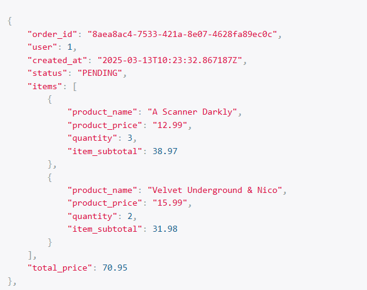

# 启动项目
```shell
python manage.py runserver
```
# 学到了什么
# 
# Meta class的field
可以在序列化器中定义哪些字段应该被序列化和反序列化。
通过指定 `fields` 属性，可以控制哪些字段会被包含在序列化的输出中，可以不在model中。
用property也当作属性。
```python
from rest_framework import serializers
class OrderSerializer(serializers.ModelSerializer):
    items=OrderItemSerializer(many=True, read_only=True)
    total_price=serializers.SerializerMethodField(method_name='total')
    def total(self, obj):
        order_items= obj.items.all()
        return  sum(item.item_subtotal  for item in order_items)

    class Meta:
        model=Order
        fields=(
            'order_id',
            'user',
            'created_at',
            'status',
            'items',
            'total_price'
        )
```
# SerializerMethodField
用于在序列化器中添加自定义的只读字段。它通过调用序列化器类中的一个方法来获取字段的值，而不是直接从模型字段中获取。
```python
    total_price=serializers.SerializerMethodField(method_name='total')
    def total(self, obj):
        order_items= obj.items.all()
        return  sum(item.item_subtotal  for item in order_items)

    class Meta:
        model=Order
        fields=(
            'order_id',
            'user',
            'created_at',
            'status',
            'items',
            'total_price'
        )
[tq](../../../tq)
```
# 在一个序列化器中嵌套另一个序列化器
```python
class OrderItemSerializer(serializers.ModelSerializer):
    product_name=serializers.CharField(source='product.name', read_only=True) # product 序列化器
    product_price=serializers.DecimalField(
        source='product.price',
        max_digits=10,
        decimal_places=2,
    ) 
    class Meta:
        model=OrderItem
        fields=(
            'product_name',
            'product_price',
            'quantity',
            'item_subtotal',
        )
```
